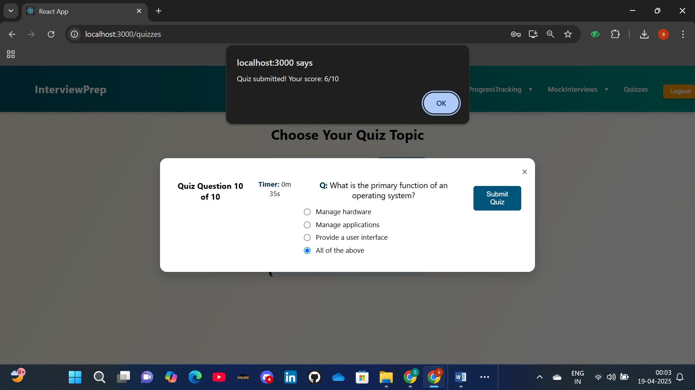
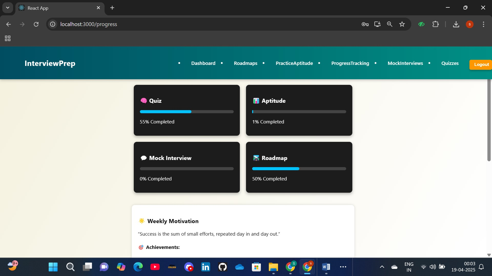
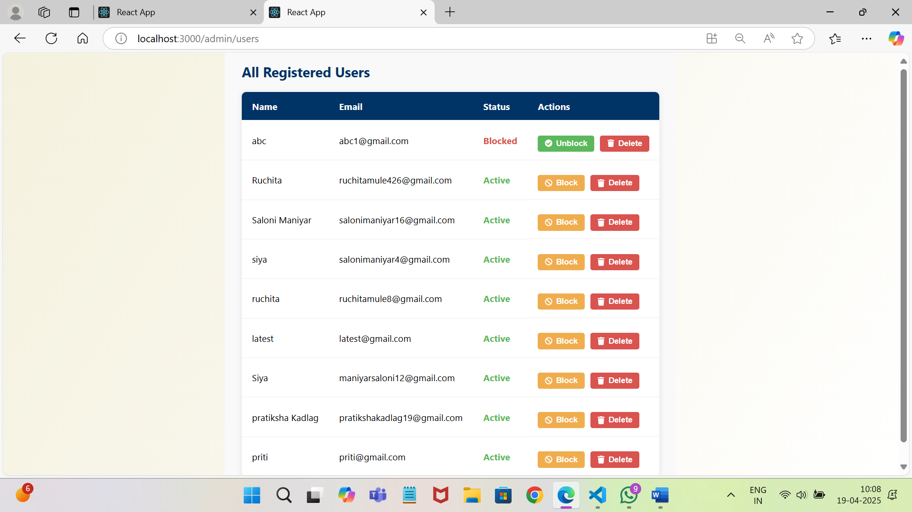

# 🎯 Interview Preparation Guide (MERN Stack)

A full-stack Interview Preparation Guide built using the **MERN Stack** to help users prepare for job interviews with confidence. It includes curated learning roadmaps, aptitude and quiz modules, mock interviews with feedback, progress tracking, and role-based admin access.

---

## ✨ Features

- 🔐 User and Admin Login/Registration with JWT authentication  
- 🗂️ Learning Roadmaps for guided preparation  
- 🧠 Aptitude Practice and MCQ-based Quizzes (separate modules)  
- 🎤 Mock Interview Module with keyword-based feedback  
- 📊 Individual Progress Tracking  
- 🧑‍💼 Admin Panel for managing Roadmaps, Questions, Users, Contacts  
- 📬 Contact Us form handling  
- 📁 Screenshots folder included to preview UI  

---

## 🛠️ Tech Stack

- **Frontend:** React.js, CSS (no Tailwind used)  
- **Backend:** Node.js, Express.js  
- **Database:** MongoDB with Mongoose  
- **Authentication:** JWT & bcrypt  
- **Testing Tools:** Postman  

---


---

## 🧾 Folder Structure

```
interview-prep-guide-website/
│
├── backend/
│   ├── config/            # DB connection and AI service configs
│   ├── middleware/        # Auth middlewares
│   ├── models/            # Mongoose schemas
│   ├── routes/            # API routes (auth, quiz, roadmap, etc.)
│   └── scripts/           # Admin seed, etc.
│
├── Frontend/
│   ├── public/
│   └── src/
│       ├── api/           # Axios configurations
│       ├── components/    # Reusable components
│       ├── pages/         # UI pages
│       └── styles/        # Plain CSS files
│
├── Screenshots/           # UI preview images
├── server.js              # Main server file
├── README.md
```

---

## 🚀 Getting Started

1. **Clone the repo**
   ```bash
   git clone https://github.com/Saloni-Maniyar/interview-prep-guide-website.git
   ```

2. **Backend Setup**
   ```bash
   cd backend
   npm install
   npm start
   ```

3. **Frontend Setup**
   ```bash
   cd Frontend
   npm install
   npm start
   ```

4. **Environment Variables**
   Create a `.env` file in the backend with the following:
   ```
   MONGO_URI=your_mongodb_connection_string
   JWT_SECRET=your_jwt_secret
   ```

---

## 👥 Team Contributions

### 🧑‍💻 Saloni Maniyar

- Developed the **entire backend** excluding admin and contact modules.
- Handled **JWT-based authentication** for users and admins with password hashing (bcrypt).
- Built all routes for:
  - User authentication and profile
  - Roadmap
  - Quiz
  - Aptitude
  - Interview (including mock feedback)
  - Progress tracking
- Integrated and tested backend using **Postman**.
- Set up **MongoDB schemas** and performed database configurations.
- Contributed to frontend (interview module).
- Responsible for final backend testing.

### 🧑‍🎨 Ruchita Mule

- Designed and implemented **Complete frontend UI** using React and CSS.
- Created:
  - Home, About, Blog, FAQ, Features, Contact Us, Login/Register pages
  - Aptitude and Quiz frontends
  - Roadmap visualization
  - Admin dashboard and all admin management pages
- Developed backend and frontend for **admin** and **contact** modules.
- Made frontend-level improvements and minor backend enhancements.

---

## 📸 Screenshots

### 🏠 Homepage


---


### 📄Informational Pages


  
  
  
  
  
  


---

### 🚀 Project Features (User Perspective)

#### Roadmaps

  
  
  


#### Aptitude

  
  


#### Quiz

  


#### Mock Interview

  
  
  


#### User Progress

  


#### Authentication


---

### 🛠️ Admin Dashboard and Management

  
  
  
  
  


---


---.
